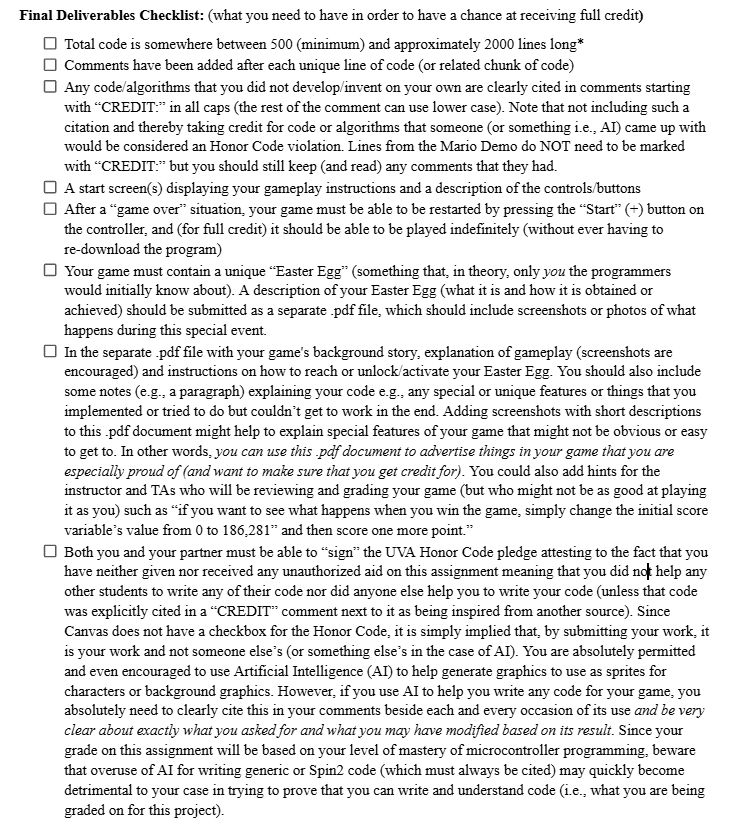
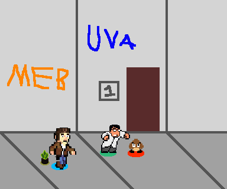
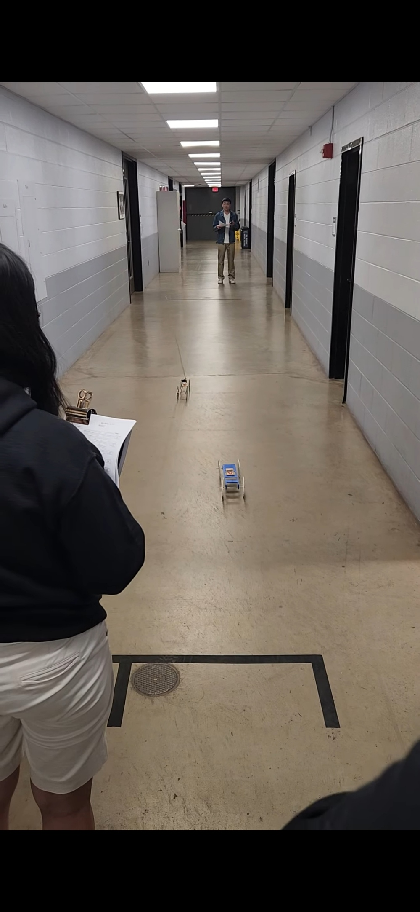
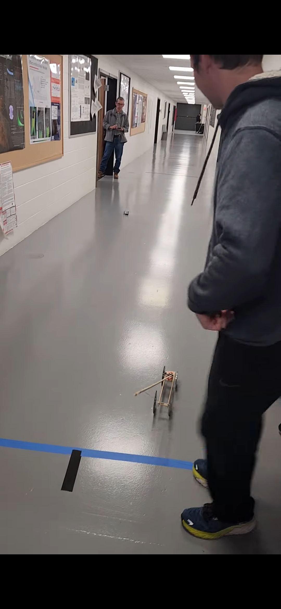
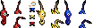

# Video Game Project

By: Manuel Oliveira & Bob Kammauff
UVA Mechatronics Sp26

## Goal

Make a dungeon side-scrolling beat-em up starring prof. Momot & prof. Garner exploring a newly formed cave in the basement of the MEB in hopes of rescuing prof. Natasha Smith from the evil prof. Griffiths

## Initial Concept
### Story
As described above. SPOILERS!!: Natasha Smith is actually the villain

### Mechanics
Prof. Momot will be the usual brawler with a sort of dark superman/magneto complex (being able to hover for short periods of time using his Papist Magic). The hope is that Prof. Garner will play as an Olimar/Pikmin-style character by throwing TA's at enemies to fight.

## Deliverables

### Plan for completion + Deadlines

1. We need to build the "engine"

I think this should be the goal for friday Mar. 28th and the rough draft: Make a lil tech demo that we can run around in. I've made a mockup of what it could look like:

We need to import the pre-existing sprites that already exist, and then make some placeholder ones (or just go ahead and make them) for the ones we don't have yet. Biggest priorities for the features: 
1. Moving & Jumping in the 2.5D space

    - Use the drop shadows to determine position in the xz plane

2. Animations and actions, Character properties

    - Determine a moveset for Momot.
    - Which buttons for light, heavy attacks
    - Do we have a health bar?

This shpuld help us get started and then we can keep going from there.

I'm basing a lot of my ideas about how the game looks and plays based off of Double Dragon. [Here's](https://youtu.be/NkuB2PWJssY?si=GuOCqAQArytiKDvg) a youtube link for reference.

## Log
3/23/26 - Bob started up the repo and started planning the design of the game. Hopefully can start looking at some code tomorrow.

3/24/26 - Starting on some of the spritework:

I'm just thinking about the tile sets that I'd need for this.

The floor tiles are going to have the reflection coming off of the fluorescents. One for the first floor, one for the basement

.png)
.png)
.png)
.png)

These can be rotated to get the bottom half of the parallelogram

I ended up going back on the design, so now this is the floor tile:

...which can be rotated in order to have it tile effectively!

3/25/26 - Garner Sprites

[Reference for pikmin](https://www.deviantart.com/pikmin789/art/Pikmin-Sprite-Sheet-2-101570656)

I started out by making all of these pikmin sprites!

These should cover them walking, attacking, and equipping the fabled monocle

3/27/26 - Another day another dollar, I think. I'll import the log from the other day, but the big thing is that I'm going to try and work smarter this time in order to get the second controller working. Testing frequently and getting it working bit by bit. 

Manuel added a hitbox to the attacking, an hp bar, and now the bullet bill drops a gem that can heal hp. 

I think the first thing I should do is get a second player character loaded up, so I have someone to even control. Time to load in Garner sprites. And then just copy enough code so that his motion is controlled by the first controller. And then work on the second controller integration, working from the controller tester. In fact, maybe I'll just go run that first to make sure both controllers work...

Ok yes they do!! Good.

Ok, Made good progress. More to follow

3/28/26 - GARNER IS PLAYABLE!
I'm Working on getting him actionable, but I've made a significant amount of progress as of late.

I've added a LOT to the code to help abstract it, including sprite constants and the player state updater. I did completely break collision detection, but I'm hoping it won't be too hard of a fix. With the second player, it might just be better to try and rewrite the other methods so that they run inside of the new context. I think that it could be useful to start to get an idea of how much time each component of the loop adds, so then we know what we really need to run on a different cog. Maybe replace the controller inputs with random byte generators to see how much processing it takes to talk with them. 

Ideally, I think the cogs would function like how they do in this diagram i got from Copilot:

## Cog Allocation Table

| **Cog** | **Role**                          | **Details**                                   |
|--------:|-----------------------------------|-----------------------------------------------|
| **0**   | Main Game Loop                    | Reads controller data; updates game state; writes to video buffer |
| **1**   | Controller #1 Reader              | I2C bus A                                     |
| **2**   | Controller #2 Reader              | I2C bus B                                     |
| **3**   | Video Driver                      | To the debug window                               |
| **4**   | Audio Synth / SFX (eventually)                | Sound generation and effects                  |
| **5**   | Physics / Animation *(If needed for garner's eyes)*  | Optional physics or animation subsystem       |
| **6**   | Debug / Serial / Telemetry *(optional)* | Logging, serial output, instrumentation |
| **7**   | Debug / Serial / Telemetry *(optional)*                               | Logging, serial output, instrumentation                          |

Although, this might require considerable rewrites of the code to work. Maybe it won't be as bad as I think it will tho...

Maybe if I start drawing up some pseudo code for it, at least the screen rendering. 

I also think there needs to be some sort of time syncing, but i'm not certain how that could be handled... 

Anyways, I guess that's a problem for another day...

4/5/26 

Ok, final push on this. Manuel has made really great progress on this, and now its time for me to bring some fresh idea.

Let me start listing things that I want to change:

- Pikmin Walk Cycle & Homing behavior
- Better/floatier jumping behavior
- playerMotion all being handled together
- Limit the amount of controller inputs being written to only the ones being used
    - Ok so it looks like it increments through them automatically, so there's not an easy way to stop that ram being used. I do think the movement animations could be dealt w/ in player motion, which would help the lag

Ok, I've been working on the better jumping behavior. I'm running into an issue with updating the playerPos based on this, since now it's more of a physics-based jump system

I think i need a playerz var now to deal with limiting the location. no getting around it.

OK! It's working fairly well!

4/6/26 - Final Push!!!

- Continuing work on sprite calcs and updating Garner as well

